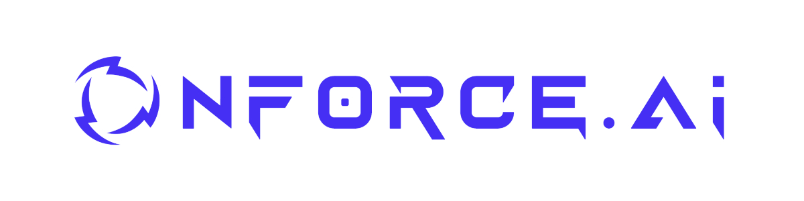

  

# NForce AI

NForce AI builds next-generation AI products for operators, revenue teams, and SMBs.  
We develop both commercial AI solutions and open-source tools that empower technical users.

Our work spans two product lines and a growing ecosystem of open-source integrations:

---

## The NForce Platform (Commercial)

A full-stack, multi-channel AI platform designed for SMBs and agencies:

- Chat, Email, Phone, and WhatsApp assistants  
- Visual flow builder  
- Smart Tags, Interventions, Escalations  
- CRM connectors (HubSpot, Zoho, Salesforce, etc.)  
- Tenant-isolated / private-cloud deployments  
- Analytics, dashboards, audit logs  
- Managed services for implementation & support  

The NForce Platform is **closed-source**, enterprise-grade, and sold as SaaS.

👉 **Website:** https://nforce.ai

---

## SDRbot

A sovereign, terminal-native AI agent for RevOps, SDRs, and sales engineers.  
Runs locally, uses your own API keys, and automates real workflows without vendor lock-in.

- Local execution  
- CLI-first design  
- Integrations with popular CRMs and data tools  
- Safe-mode workflow planning  
- 100% free & open-source  

👉 **Repo:** https://github.com/NForce-ai/SDRbot  
👉 **Website:** https://sdr.bot

---

## Medusa NForce Plugin

A Medusa v2 plugin that connects your e-commerce store to the NForce Platform.  
Real-time product sync to NForce knowledge bases, plus live customer and order lookup for AI agents.

- Zero-config setup driven from NForce — install the plugin and go  
- Automatic product catalog sync with custom module and field selection  
- Category filtering, storefront URL integration, custom module discovery  
- Admin page with sync status, linked AI agents, and channel snippets  
- Single security surface: all NForce traffic through `/admin/nforce/*`  

👉 **Repo:** https://github.com/NForce-ai/medusa-plugin-nforce

---

## What We Build

We focus on tools that combine:

- High operational leverage  
- Control, sovereignty, and data privacy  
- Deep agentic reasoning  
- Real business integrations  
- Practical workflows used in real companies  

Whether open-source or commercial, every NForce product is built for serious operators.

---

## Follow Our Work

- **Website:** https://nforce.ai  
- **GitHub:** https://github.com/NForce-ai  
- **SDRbot:** https://sdr.bot
